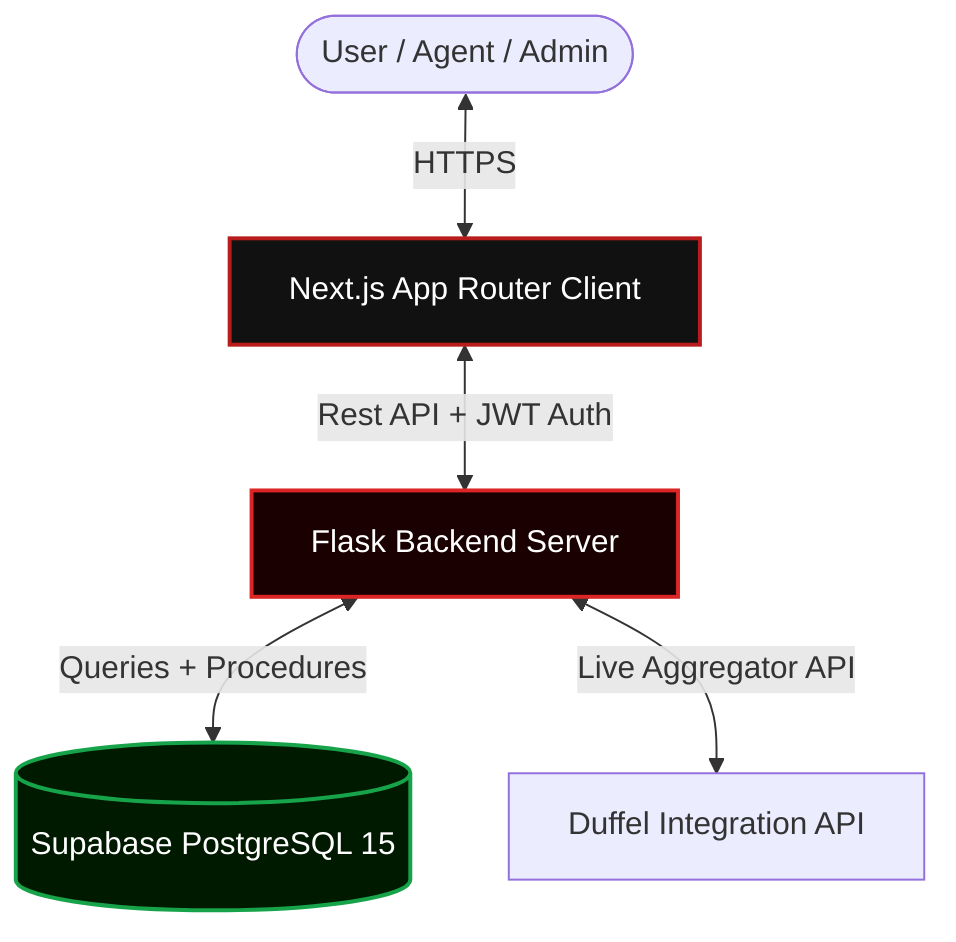
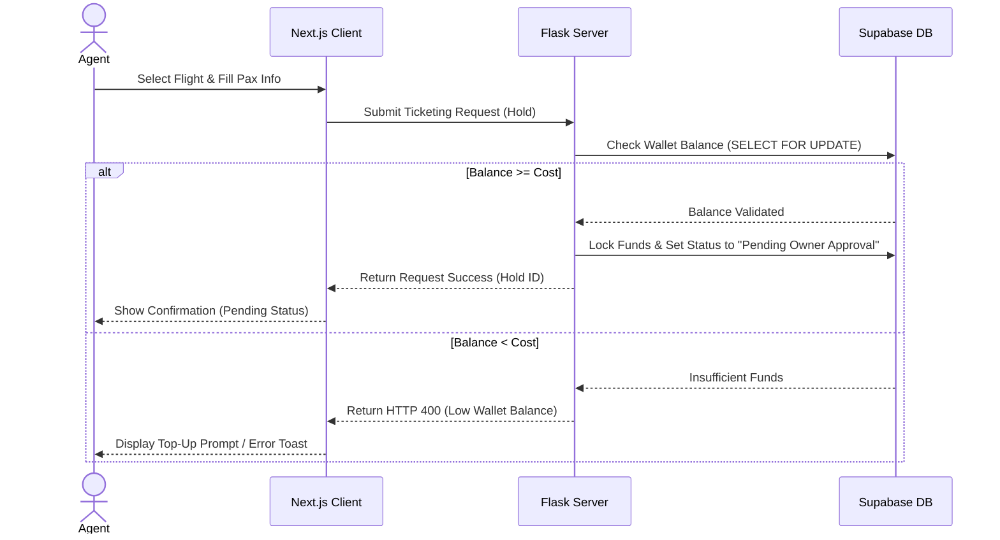

# <div align="center">✈️ SkyWays — Enterprise Flight Booking & B2B Portal</div>

<div align="center">
  
  
  
  
</div>

---

SkyWays is a high-performance, full-stack flight booking system and B2B travel agency portal. Built around a modern dark-mode obsidian glassmorphism aesthetic, it integrates flight aggregation, transaction-safe booking seat-mapping, real-time ticket hold clearance, digital wallet management, and automated boarding pass printing in a unified monorepo.

> [!IMPORTANT]
> **This repository is configured for two distinct user experiences:** 
> 1. **B2C Customer Portal:** Flight searching, booking, interactive seat maps, passenger profile updates, and booking history/tickets.
> 2. **B2B Travel Agent Portal:** Multi-currency wallet settlements, booking hold submission, sub-agent tracking, and ticketing approval loops.

---

## 🧭 Table of Contents
* [✨ Core Features](#-core-features)
* [🏗️ System Architecture](#️-system-architecture)
* [⚡ B2B Ticket Request Flow](#-b2b-ticket-request-flow)
* [📁 Repository Topology](#-repository-topology)
* [🚀 Setup & Local Execution](#-setup--local-execution)
* [🔒 Security & Production Configurations](#-security--production-configurations)

---

## ✨ Core Features

### 👤 B2C Passenger Client
* **Search Engine:** Support for One-Way, Round-Trip, and Multi-City flight legs with automatic date/destination rules.
* **Seat Selection:** Highly interactive, graphical seat map organizing seats by Economy, Business, and First class.
* **E-Ticketing:** Automated barcode generation and ticket receipt downloads.
* **Passenger Dashboard:** Manage flight changes, view profile statistics, and process booking cancellations.

### 💼 B2B Travel Agent Portal
* **Live API Search:** Real-time availability queries mapped to mock global carriers and DUFFEL flight APIs.
* **Pre-paid Agency Wallet:** Multi-currency balance top-up (PKR, USD, AED, GBP) allowing instant ticket issuance.
* **Approval Ticketing Loop:** Agents submit bookings on hold, locking the ticket cost in the wallet until the site administrator confirms or rejects the issue request.
* **Agency Analytics:** Sub-agent activity reporting, custom fee/markup rules, and revenue logging.

---

## 🏗️ System Architecture

Our architecture separates concerns between a serverless database backend, a secured API wrapper, and a decoupled React layout client.



---

## ⚡ B2B Ticket Request Flow

The sequence diagram below displays the transaction-safe mechanism designed to handle agent wallet deductions and hold locks:



---

## 📁 Repository Topology

```
skyways/
├── backend/                 # 🐍 PYTHON FLASK BACKEND
│   ├── app.py               # Flask application factory & CORS configuration
│   ├── config.py            # Global Supabase & environment definitions
│   ├── requirements.txt     # Backend PIP dependencies
│   ├── routes/
│   │   ├── auth.py          # User login, JWT validation & profile settings
│   │   ├── flights.py       # Live queries, seat mapping info & availability dates
│   │   ├── bookings.py      # Passenger checkouts & cancellation transactions
│   │   ├── agents.py        # B2B Wallet balance, holds, & notification alerts
│   │   └── duffel.py        # Duffel API aggregator routes
│   └── db/
│       ├── schema.sql       # Database table DDL layouts
│       ├── seed.sql         # Base data seeds (Airports, Airlines, Flights, Seats)
│       ├── views.sql        # Occupancy, sales, and popularity reporting views
│       ├── triggers.sql     # Database trigger hooks (auto seat release)
│       └── procedures.sql   # SQL Transaction functions (fn_book_flight)
├── frontend-next/           # ⚛️ NEXT.JS FRONTEND CLIENT
│   ├── src/
│   │   ├── app/
│   │   │   ├── layout.js    # Global layouts, Google fonts, state providers
│   │   │   ├── page.js      # Main B2C Search landing page
│   │   │   ├── search/      # Flights search results view with filter lists
│   │   │   ├── booking/     # Passenger form layout & active seat selector
│   │   │   ├── agent/       # Agent landing page, register forms, & B2B dashboard
│   │   │   ├── dashboard/   # User booking details & printable boarding passes
│   │   │   └── not-found.js # Custom branded glassmorphism 404 page
│   │   ├── components/      # Common Navbar, Sidebars, and dynamic Toast alerts
│   │   ├── context/         # AuthContext & AgentContext providers
│   │   └── utils/           # API fetch wrappers and formatting helpers
│   ├── tailwind.config.js   # Custom obsidian theme config and animation tokens
│   └── package.json         # Node package scripts
└── README.md                # 📄 Project Documentation
```

---

## 🚀 Setup & Local Execution

### 1. Database Setup (Supabase)
1. Register a database project at [supabase.com](https://supabase.com).
2. Go to the **SQL Editor** inside your Supabase dashboard.
3. Open, review, and execute the SQL scripts in `backend/db/` in this **exact order**:
   * `schema.sql` ➔ Creates DDL schema layout and indexes
   * `seed.sql` ➔ Populates baseline rows (airports, airlines, flights)
   * `views.sql` ➔ Creates analytics SQL reporting views
   * `triggers.sql` ➔ Configures status log triggers
   * `procedures.sql` ➔ Configures transaction functions

### 2. Backend Setup
1. Move to the backend folder:
   ```bash
   cd backend
   ```
2. Create and active a Python virtual environment:
   ```bash
   python -m venv venv
   # Windows:
   venv\Scripts\activate
   # macOS/Linux:
   source venv/bin/activate
   ```
3. Install dependencies:
   ```bash
   pip install -r requirements.txt
   ```
4. Copy `.env.example` as `.env` and fill in your Supabase variables.
5. Launch Flask:
   ```bash
   python app.py
   # Runs locally at http://127.0.0.1:5000
   ```

### 3. Frontend Setup
1. Move to the frontend folder:
   ```bash
   cd ../frontend-next
   ```
2. Install npm packages:
   ```bash
   npm install
   ```
3. Boot the Next.js development server:
   ```bash
   npm run dev
   # Server listens at http://localhost:3000
   ```

---

## 🔒 Security & Production Configurations

To ensure enterprise-grade security, configure the following environment properties before deploying to production servers:

### Backend Environments (e.g., Render / Heroku)
* `SUPABASE_URL`: Supabase project endpoint.
* `SUPABASE_KEY`: Supabase anon key for public row access.
* `SUPABASE_SERVICE_KEY`: Service role bypass token.
* `ALLOWED_CORS_ORIGIN`: Set this exclusively to your Next.js public URL (e.g. `https://your-domain.vercel.app`).
* `DEBUG`: Set to `False` in production to prevent traceback leaks.

### Frontend Environments (e.g., Vercel / Netlify)
* `NEXT_PUBLIC_API_URL`: Root path of your hosted Flask REST backend.
